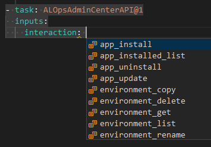

# Build Steps Overview

ALOps provides a set of building blocks that enables you to create your own build and deployment pipelines. The building blocks are called **Build Steps** and are defined in YAML files.  Let's take a look at the build steps that are available in ALOps.

Related:
[Build steps v2](Buildstepsv2.md)

## ALOps AdminCenter API
This buildstep lets you interact with the AdminCenter API.  As such, this is a wrapper for the default Admin API and provides these interactions:



So pretty much working with "apps" and "environments", like creating DEV environments, or TEST environments in SaaS during a pipeline.

Full Yaml Description:

!INCLUDE "ALOpsAdminCenterAPI_v1.md"

## ALOps AppSource
The purpose of this step is to upload your apps to your offerings on AppSource.

It's smart.  As you can see below, there isn't much you need to set up, other than your connection to partnercenter.  This is how it works:

- in a pipeline (probably a release pipeline), you foresee all the artifacts
- "ALOpsAppSource"-step will read your offerings on AppSource
- It will first find the "main" artifact, that corresponds with your offering
- it will find all dependencies (recursive) of that main artifact
- it will upload all artifacts to AppSource, in the correct way
- it will do that for all offerings it can find all artifacts for

`autopromote`: When you want to automatically publish your app after it has been validated online, set autopromote to "true"

!INCLUDE "ALOpsAppSource_v1.md"

## ALOps Agent Maintenance

Cleanup and maintain DevOps a Agent for Business Central.

> TIP: It's a good practice to run the cleanup-operation after every pipeline.  This way, you will keep ALL your DevOps Agents in shape!

Full Yaml Description:

!INCLUDE "ALOpsAgentMaintenance_v1.md"

## ALOps App License Check

Check App files against a Business Central License File.  The scope is obviously "OnPrem", since in SaaS, there is no license file!

Full Yaml Description:

!INCLUDE "ALOpsAppLicenseCheck_v1.md"

### Scenarios

#### 1. OnPrem Customer development

Add the step in a Validation pipeline, so that every time the code is being validated, the code is also validated against a license file.  Some tips:

- Add the license file to a Blob Storage, so you can simply update the license file, and keep our download-url the same when license has to be updated
- Exclude ranges that don't need to be validated, like: `60000..60099,6086200..6086299,6225181..6225270`
- You can also exclude test-apps, if you are able to refer to the appname.  Like: `*-TEST_*`

## ALOps App Runtime Package

Get a NAV App runtime package for OnPrem deployment.

Full Yaml Description:

!INCLUDE "ALOpsAppRuntimePackage_v1.md"


## ALOps App Sign

Codesign Business Central extension with .pfx.f

Full Yaml Description:

!INCLUDE "ALOpsAppSign_v1.md"

### Examples

- [Use Docker, Sign And Verify · HodorNV/ALOps · GitHub](https://github.com/HodorNV/ALOps/blob/master/Examples/09_UseDocker_SignAndVerify.yml)	
- [CompilerV2 combined with AppSigning](https://github.com/HodorNV/ALOps/blob/master/Examples/Compiler%20V2/06_AppSigning.yml)

## ALOps App Sign Verify

Verify CodeSign of Business Central extension.

Full Yaml Description:

!INCLUDE "ALOpsAppSignVerify_v1.md"
### Examples

- [Use Docker, Sign And Verify · HodorNV/ALOps · GitHub](https://github.com/HodorNV/ALOps/blob/master/Examples/09_UseDocker_SignAndVerify.yml)	

## ALOps App Test

Run Business Central Test-Suite and collect results.

> Note! when you run the step, and it executes no tests, the step will fail!  This is by design, because it's a good practice to always have tests in your app.  If you don't have tests, you can simply add a dummy test, like this:
```al
[Test]
procedure DummyTest()
begin
    exit;
end;
```
Or - simply use the parameter `allow_zero_tests: true` to allow the step to pass when no tests are found. ([ref](https://github.com/HodorNV/ALOps/issues/741))

Full Yaml Description:

!INCLUDE "ALOpsAppTest_v1.md"

### Examples

-  [Default Build Including Tests · HodorNV/ALOps · GitHub](https://github.com/HodorNV/ALOps/blob/master/Examples/01_DefaultBuild_IncludingTestability.yml)

## ALOps App Validation

Validate App from Business Central AppSource.  This step is a wrapper of the BCContainerHelper, which means we're fully dependent on its workings.  We noticed it's not 100% aligned with the online check, but it obviously gives you a good indication.

> TIP: it works quite well in a Release Pipeline in DevOps, where you can simply combine the artifacts of multiple apps (pipelines).

Full Yaml Description:

!INCLUDE "ALOpsAppValidation_v1.md"
    
## ALOps App Clean

Remove all extensions from Business Central service tier.

Full Yaml Description:

!INCLUDE "ALOpsAppClean_v1.md"
    
## ALOps App Copy

Copy Business Central extensions from one service tier to another.

Full Yaml Description:

!INCLUDE "ALOpsAppCopy_v1.md"
    
## ALOps App Compiler

Compile a Business Central extension from AL code. 

> TIP: there is also a V2 compiler, which is much faster and is smarter, as it will figure out dependencies and such!  More info here: [ALOpsAppCompiler_V2](Buildstepsv2.md#ALOps App Compiler)

Full Yaml Description:

!INCLUDE "ALOpsAppCompiler_v1.md"

### Parameters
#### nav_app_version
let's you manage the version of the app during the compile step.

You can use a combination of the following

- `?`: takes the corresponding app-version from the app.json (from the "version" property)
- `A`: takes the corresponding Applicaiton-version from the app.json (from the "application" property)
- `*`: takes the build number from DevOps
- `[yyyyWW]`: You can use the default .Net date fromats to formate a date number (in this example the year and weeknumber) into the version

Examples:

- `A.A.*.0` - will take the Major and the Minor from the Application you have defined in app.json, the build number from DevOps, and the revision number will be 0
- `?.?.[yyyyWW].*` - will take the Major and the Minor from the Version you have defined in app.json,  the build number from DevOps, and the revision number will be the build number
- `?.?.?.?` - will simply take over the version from app.json

### Examples

- [Default Build Including Tests · HodorNV/ALOps · GitHub](https://github.com/HodorNV/ALOps/blob/master/Examples/01_DefaultBuild_IncludingTestability.yml)
- [Use Docker Compile · HodorNV/ALOps · GitHub](https://github.com/HodorNV/ALOps/blob/master/Examples/03_UseDocker_Compile.yml)   

## ALOps Docker Execute

Execute powershell script in container.

Full Yaml Description:

!INCLUDE "ALOpsDockerExec_v1.md"
    
## ALOps Docker Remove

Remove Business Central docker container.

### Parameters

#### createeventlogbackup
Controls whether to create an event log backup from the container before removal. This is particularly useful for debugging pipeline issues.

**Options:**
- `Always` - Always create event log backup
- `OnFailure` - Only create backup when the build fails
- `Disabled` - Don't create event log backup (default)

> **Important:** The parameter accepts `Always`, `OnFailure`, or `Disabled` - NOT "enabled" or "true".

**Use Case:** When troubleshooting pipeline hangs during app installation/publishing, set this to `Always` and check the build artifacts for error details. See [Q&A: Pipeline hangs during app installation](../Help/QnA.md#my-pipeline-hangs-during-app-installationpublishing-how-can-i-debug-this) for more information.

Full Yaml Description:

!INCLUDE "ALOpsDockerRemove_v1.md"

### Examples

	- [Run Powershell In Container · HodorNV/ALOps · GitHub](https://github.com/HodorNV/ALOps/blob/master/Examples/07_UseDocker_RunPowershellInContainer.yml)

## ALOps Docker Create

Create Docker image based on NAV/BC Artifacts.

Full Yaml Description:

!INCLUDE "ALOpsDockerCreate_v1.md"

> TIP: use the versionselect "weekly", in combination with "forcecreateimage: false" to try to reuse images on a given agent.

### Scenarios

You can use this step to create/manage your own images (and even upload them to your own docker registries).

Or  create the image on the spot, during a code-validation pipeline.  In this case, it should be followed by [ALOpsDockerStart](#ALOps Docker Start) and [ALOpsDockerWait](#ALOps Docker Wait).

## ALOps Docker Start

Start Business Central docker container.  Usually, this step is combined in the following sequence:

```yaml
- task: ALOpsDockerCreate@1
  displayName: 'ALOps - Create Docker Image if necessary' # It will reuse the image if already exists, or build one if it doesn't.
  inputs:
    artifacttype: Sandbox
    versionselect: Weekly
    licensefile: '$(bc.license)'  # more info: https://www.youtube.com/watch?v=iVLOerdCuwA&t=3078s

- task: ALOpsDockerStart@1
  displayName: 'ALOps - Start Docker Container' # No need to provide any details - it will get the details from previous step
  inputs:
    docker_pull: false
    docker_parameters: | 
      --env customNavSettings=EnableTaskScheduler=false 
    licensefile: '$(bc.license)'

- task: ALOpsDockerWait@1
  displayName: 'ALOps - Wait for Docker Container to start'
  inputs:
    search_string: 'Ready for connections!'
```

This particular step will create and start the container, which you have to wait for (see [ALOps Docker Wait](#ALOps Docker Wait))

Tip: with the `docker_parameters` you can add additional parameters to the docker run command.  

Some examples:

- In the example above, we disable the TaskScheduler.  
- To disable SSL: `docker_parameters: '--env useSSL=N'` ([ref](https://github.com/HodorNV/ALOps/issues/773))
- To set PublicDNSName: `docker_parameters: '--hostname $(dockerName).int.abc.at'` ([ref](https://github.com/HodorNV/ALOps/issues/772))

Full Yaml Description:

!INCLUDE "ALOpsDockerStart_v1.md"
    
## ALOps Docker Wait

Wait until the Business Central container is started.  The step is actually going to monitor the output, and when it runs into the string "*Ready for connections!*" (you can change this default value), it pretty much ends the step.  

You need this step as a following step of the [ALOps Docker Start](#ALOps Docker Start).

Full Yaml Description:

!INCLUDE "ALOpsDockerWait_v1.md"
    
## ALOps Extension API

This is mainly a wrapper for the default Business Central Automation API, to make it possible to upload extensions, get info, .. .   

> TIP: The Automation API was intended to only work in SaaS, but it is possible to also make it work OnPrem by using the ALOps.ExternalDeployer.  More info here: [Deploying from DevOps the right way: enabling External Deployment in OnPrem Business Central environments (waldo.be)](https://www.waldo.be/2020/06/15/deploying-from-devops-the-right-way-enabling-external-deployment-in-onprem-business-central-environments/)

For authentication, it's important to set it up correctly!  We would advise to use Service-to-Service authentication.  The best description we could find is here: https://www.kauffmann.nl/2020/09/14/service-to-service-authentication-for-automation-apis-in-business-central/

> Important: when using `schema_sync_mode` or `schedule`, you need to use `apiversion`: "v2.0"

Full Yaml Description:

!INCLUDE "ALOpsExtensionAPI_v1.md"
    
## ALOps Fob Import

Import objects from .FOB file.

Full Yaml Description:

!INCLUDE "ALOpsFobImport_v1.md"

### Example

[Use Docker Import Fob · HodorNV/ALOps · GitHub](https://github.com/HodorNV/ALOps/blob/master/Examples/10_UseDocker_ImportFob.yml)    

## ALOps Info

Print information about ALOps and executing host.  This is a great way to debug your pipeline, because this step will give you all variables (and its values) that you have at your disposal at the time you execute this step.

It gives you info about:

- The pipeline
  - Variable name
  - Value
- Environment variables
  - Variable name
  - Value
- Windows
  - Hotfix information
- BC version
  - Artifact Version
- Drive info
- Apps
  - Runtime?
  - Contains Symbols?
  - Contains Source?
  - Symbols Only?
- ...

Full Yaml Description:

!INCLUDE "ALOpsInfo_v1.md"

### Scenarios

There are a number of scenarios to use this step, like:

- Why doesn't my pipeline find my apps?
- I would like to add a custom script, but what is the docker container that was built?
- I need to do something with my apps, but which are the apps the I compiled during this step? 
- ...

### Example

[ALops Info· HodorNV/ALOps · GitHub](https://github.com/HodorNV/ALOps/blob/master/Examples/22_ALopsInfo.yml)        

## ALOps License Import

Import Business Central license (.flf).

Full Yaml Description:

!INCLUDE "ALOpsLicenseImport_v1.md"

## ALOps OpenAPI

Generate OpenAPI descriptions from Business Central API's.  The result is an extra artifact in the form of a json or yaml file (preferred), that represents a description of the API.  You can simply copy/paste the contents of this yaml-file to a swagger editor (like: https://editor.swagger.io/) to test it out.

**<u>Important</u>!**
**You need to make sure you enabled API Services on your docker container.  When creating a docker container with ALOps, pay attention to the parameter `enable_api_services`:**

```yaml
    - task: ALOpsDockerStart@1
      displayName: 'ALOps Docker Start'
      inputs:
        ...
        enable_api_services: False            # Enable API Services. $(enable_api_services)
        ...
```


Full Yaml Description:

!INCLUDE "ALOpsOpenAPI_v1.md"

### Example

[OpenAPI · HodorNV/ALOps · GitHub](https://github.com/HodorNV/ALOps/blob/master/Examples/25_OpenAPI.yml)    

## ALOps NuGet Download

Download Business Central extensions from NuGet Package source.

This task downloads Business Central applications from NuGet sources based on a specification file. It's particularly useful for dependency management, environment setup, and ensuring consistent versions across environments.

### How it works

- The task reads a `nuget.json` specification file that defines which apps to download
- It supports authentication via username/password or API key
- Downloads apps to a specified folder with organized subfolders
- Creates a `resolved.json` file with dependency information to be used in subsequent steps
- Supports filtering by publisher and type
- Can skip Microsoft apps to reduce download time

### Key Features

- **Dependency Management**: Download required app dependencies before compilation
- **Environment Setup**: Prepare runtime dependencies for deployment  
- **Version Control**: Ensure consistent versions across environments
- **Publisher Filtering**: Control which dependencies are downloaded based on publisher
- **Type Filtering**: Select specific app types from the specification file

### Parameters

#### Authentication
- `nuget_username` & `nuget_password`: Basic authentication credentials (store password as secure variable)
- `nuget_source_apikey`: Alternative API key authentication (store as secure variable)

#### Configuration
- `nuget_spec_file`: Path to JSON specification file (default: `$(System.DefaultWorkingDirectory)\nuget.json`)
- `nuget_select_type_filter`: Filter specific types using wildcards (e.g., `MyApp*`)
- `download_folder`: Target directory for downloaded apps (default: `$(System.ArtifactsDirectory)`)
- `dependency_publisher_filter`: Control dependency downloads by publisher (`;` separated, use `NONE` to skip all)
- `skip_microsoft_apps`: Skip Microsoft-published apps (default: `true`)

### Example nuget.json specification file

```json
{
  "Types": [
    {
      "name": "Runtime",
      "deploy": true,
      "feeds": [
        {
          "feed": "https://api.nuget.org/v3/index.json",
          "dependencies": [
            {
              "id": "MyCompany.MyApp",
              "version": "1.0.0"
            }
          ]
        }
      ]
    }
  ]
}
```

Full Yaml Description:

!INCLUDE "ALOpsNugetDownload_v1.md"

## ALOps NuGet Publish

Publish Business Central extension to NuGet Package source.

This task publishes Business Central applications to NuGet sources after successful compilation. It's typically used in Build and Release pipelines to automatically publish apps to NuGet feeds for distribution and dependency management.

### How it works

- The task searches for Business Central app files (.app) in the specified directory
- It supports various file filters to select specific apps for publishing
- Authenticates with NuGet sources using API key or username/password
- Supports version suffixes for pre-release packages
- Can apply version suffixes to dependencies from the same publisher

### Key Features

- **CI/CD Integration**: Automatically publish apps after successful build
- **Pre-release Publishing**: Use version suffixes for beta/preview releases  
- **Dependency Management**: Publish libraries for consumption by other projects
- **Flexible Authentication**: Support for API key or username/password authentication
- **File Filtering**: Control which apps are published using file patterns

### Parameters

#### Required Parameters
- `nuget_source_uri`: The URL of the NuGet repository where apps will be published

#### App Discovery
- `artifact_path`: Directory where .app files are located (default: `$(System.ArtifactsDirectory)`)
- `artifact_filter`: File pattern to locate app files (default: `*.app`)
  - `*.app`: All .app files
  - `MyApp*.app`: Apps starting with "MyApp"  
  - `**/*.app`: All .app files recursively in subdirectories

#### Authentication
- `nuget_username` & `nuget_password`: Basic authentication credentials (store password as secure variable)
- `nuget_source_apikey`: Alternative API key authentication (store as secure variable)

#### Version Management
- `suffix`: Version suffix for pre-release packages (e.g., "beta", "rc1", "preview")
- `use_suffix_for_dependencies_same_publisher`: Apply suffix to dependencies from same publisher (default: `false`)

### Example

A typical upload to Azure Artifacts
```yaml
  - task: ALOpsNugetPublish@1
    inputs:
      nuget_source_uri: 'https://pkgs.dev.azure.com/ALOps/test/_packaging/test/nuget/v2'
      nuget_username: 'devops'
      nuget_password: '$(devops_pat)'
      nuget_source_apikey: '$(devops_pat)'
      artifact_filter: '*.app'
      pwsh: true
```

> **Tip**: we suggest to use v2 as v3 api demands quite some agent setup. [More info](https://learn.microsoft.com/en-us/azure/devops/artifacts/nuget/nuget-exe?view=azure-devops&tabs=windows)

> **Security Tip**: Always store API keys and passwords as secure variables in Azure DevOps Library

Full Yaml Description:

!INCLUDE "ALOpsNugetPublish_v1.md"

## ALOps Package Import

Import and Process RapidStart/Configuration Package

***Remark: This doesn't work at the moment and is being worked on!***

Full Yaml Description:

!INCLUDE "ALOpsPackageImport_v1.md"
    
## ALOps App Publish

Publish Business Central extension to service tier.  This publish will NOT use the Automation API, so the DevOps agent needs to exist on the same server as the serverinstance where you want to install the apps.

> TIP: Use ALOps.ExternalDeployer in combination with the [ALOps Extension API](#ALOps Extension API) in stead.
>
> TIP: Your serverinstances need to be a valid, supported install.  Mixing multiple serverinstances (and/or versions) on one server might cause problems!

Full Yaml Description:

!INCLUDE "ALOpsAppPublish_v1.md"

## ALOps BCPT Run

Run Business Central Performance Test.  This is a wrapper for the BCPT, which is a tool to run performance tests on Business Central.  The BCPT (**B**usiness **C**entral **P**erformance **T**oolkit) is a tool that is provided by Microsoft.

Full Yaml Description:

!INCLUDE "ALOpsBCPT_v1.md"

## ALOps BC Replay

Run Business Central Replay functionality.

Full Yaml Description:

!INCLUDE "ALOpsBCReplay_v1.md"

## ALOps Repository Publish

***Remark: This step does not work for you!  It is part of ALOps, but it's purely used by the team of ALOps and not meant to be used by its customers.***

Publish extension to ALOps Repository.

Full Yaml Description:

!INCLUDE "ALOpsRepositoryPublish_v1.md"
    
## ALOps SaaS Get Extensions

***Remark: This step is being obsoleted, and replaced by the [ALOps Extension API](#ALOps Extension API)*** 

Full Yaml Description:

!INCLUDE "ALOpsSaaSGetExtensions_v1.md"
    
## ALOps SaaS Publish Extension

***Remark: This step is being obsoleted, and replaced by the [ALOps Extension API](#ALOps Extension API)*** 

Full Yaml Description:

!INCLUDE "ALOpsSaaSPublishExtension_v1.md"

