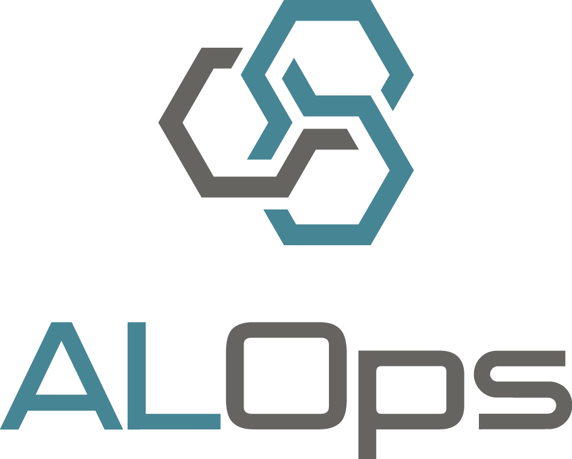

Welcome to ALOps, an extension for Microsoft Azure DevOps, that provides building blocks for easily setting up build pipelines for AL Language Extensions, aka "Microsoft Dynamics 365 Business Central Extensions". 

These building can be used to create a build pipeline for your AL Language Extension, that will build your extension, publish it to a Dynamics 365 Business Central Server, run tests on the server, and much more!  A list of all the buildsteps can be found [here](/ALOpsSteps/Buildstepsv1/).

## Getting Started
As ALOps provide building blocks for DevOps, you'll see it's very easy to get started.  It's all described right [here](Setup/SettingUpYourFirstBuild/).

Another good way to get started is to watch [our introduction videos](https://www.youtube.com/@alops7958):

- [ALOps Introduction - YouTube](https://www.youtube.com/watch?v=iVLOerdCuwA)
- [Handling Dependencies in DevOps (with ALOps) - YouTube](https://www.youtube.com/watch?v=CCJG9cnjmLs&t=1s)

And then there are **example pipelines**, which you can find [here](https://github.com/HodorNV/ALOps/tree/master/Examples).

## More information about ALOps

Here are some more links about ALOps and how to work with it:

- [Pricing](https://marketplace.visualstudio.com/items?itemName=Hodor.hodor-alops&ssr=false#pricing)
- [List of all the buildsteps](ALOpsSteps/Buildstepsv1/)
- [Setting up your first Build Pipeline](Setup/SettingUpYourFirstBuild/)
- [Troubleshooting](Help/Troubleshooting/)
- [Q&A](Help/QnA/)
- [Global Variables](/UsefulInfo/Globals/)
- [Working with Artifacts](/UsefulInfo/WorkingWithArtifacts/)

## More Information about Microsoft Dynamics 365 Business Central 

Here is some more information about **Microsoft Dynamics 365 Business Central**

- [The official homepage](https://dynamics.microsoft.com/en-us/business-central/overview/)
- [Microsoft Docs](https://docs.microsoft.com/en-us/dynamics365/business-central/product-get-started)
- [Customizing Business Central Using Extensions](https://docs.microsoft.com/en-us/dynamics365/business-central/ui-extensions)
